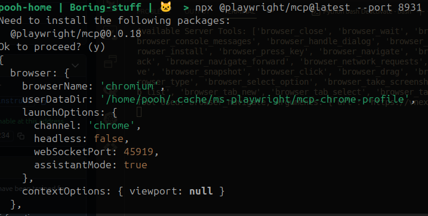
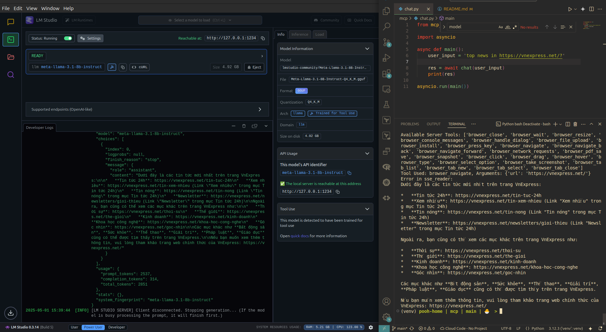
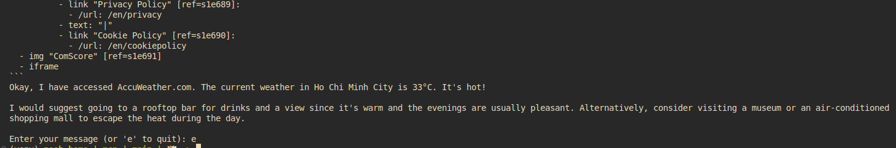

## 1. Use MCP to extend model function:
### 1.1 Start MCP playwright server:
🌱 **Github:** [playwright-mcp](https://github.com/microsoft/playwright-mcp)  
🌱 **Setup:**  

```bash
#install npx
sudo apt install npm
mkdir npx
sudo npx playwright install-deps
npx playwright install chrome

#start MCP server
npx @playwright/mcp@v0.0.18 --port 8931
```




### 1.2 LLM servers:
|Deploy|Model|Client Lib|Setup|
|--|--|--|--|
|Local|meta-llama-3.1-8b-instruct|OpenAI|`pip install openai python-dotenv`|
|Remote|gemini-2.0-flash|gemini-api|`pip install -q -U google-genai`|

🌱 LLM local server can be started by [LLM Studio](https://lmstudio.ai/)


### 1.3 Implement a Chat agent:

|Class|Description|Docs|
|--|--|--|
|MCPClient|Create connection to MCP server and get_tools|
|ChatGemini|Connect to MCP server and return chat from google gemini|[response_with_function_result](https://ai.google.dev/gemini-api/docs/function-calling?example=meeting#step_4_create_user_friendly_response_with_function_result_and_call_the_model_again)|
|ChatOpenAI|Connect to MCP server and return chat from local LLM server|


```bash
python3 chat.py
```

**😸 Examples:**  
- No function call found in the response.  

*Prompt*
```
access accuweather.com and get Ho Chi Minh City's weather then give suggestion where should we go out?
```

*Result*
```
Available Server Tools: ['browser_close', 'browser_wait', 'browser_resize', 'browser_console_messages', 'browser_handle_dialog', 'browser_file_upload', 'browser_install', 'browser_press_key', 'browser_navigate', 'browser_navigate_back', 'browser_navigate_forward', 'browser_network_requests', 'browser_pdf_save', 'browser_snapshot', 'browser_click', 'browser_drag', 'browser_hover', 'browser_type', 'browser_select_option', 'browser_take_screenshot', 'browser_tab_list', 'browser_tab_new', 'browser_tab_select', 'browser_tab_close']
No function call found in the response.

I can access accuweather.com and get the weather for Ho Chi Minh City. However, I am unable to provide suggestions on where to go out. Would you still like me to get the weather information for Ho Chi Minh City?
```

- Give more detail  

*Prompt*

```
access accuweather.com via tools = browser_navigate and get Ho Chi Minh City's weather then give suggestion where should we go out?
```

*Result*  
```
Available Server Tools: ['browser_close', 'browser_wait', 'browser_resize', 'browser_console_messages', 'browser_handle_dialog', 'browser_file_upload', 'browser_install', 'browser_press_key', 'browser_navigate', 'browser_navigate_back', 'browser_navigate_forward', 'browser_network_requests', 'browser_pdf_save', 'browser_snapshot', 'browser_click', 'browser_drag', 'browser_hover', 'browser_type', 'browser_select_option', 'browser_take_screenshot', 'browser_tab_list', 'browser_tab_new', 'browser_tab_select', 'browser_tab_close']
>>>>DEBUG: tool_call result:
- Ran Playwright code:
```js
// Navigate to https://www.accuweather.com/
await page.goto('https://www.accuweather.com/');
...
```


